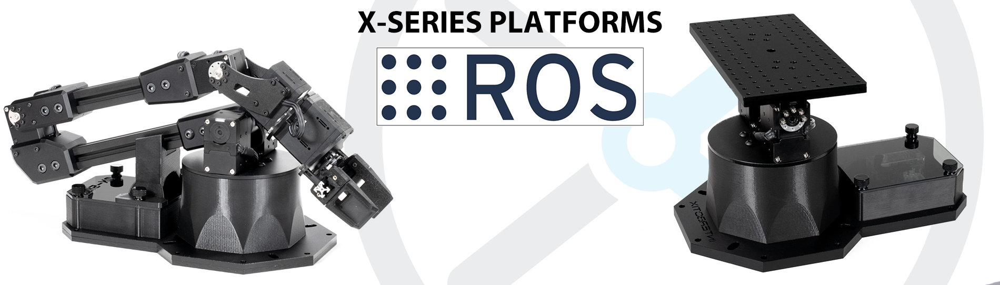
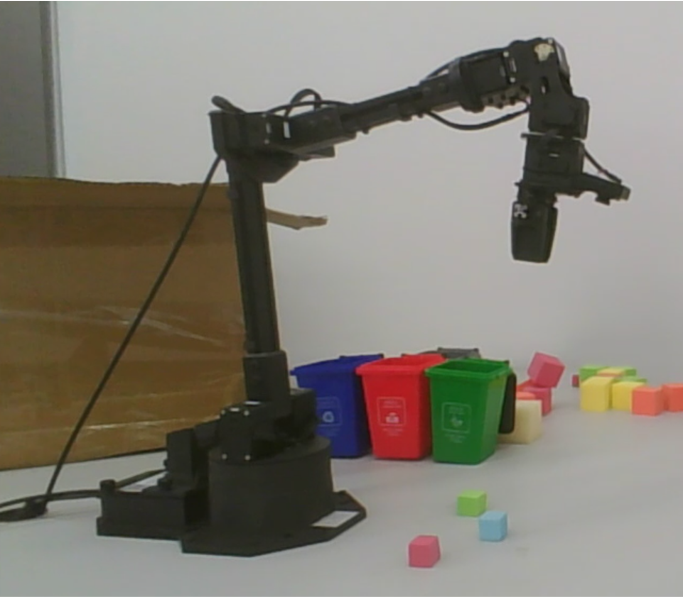

# interbotix-arm-object-detection


# Purpose

The robot arm can detect the position of the cubes and pick them. After picking the cube, the arm moves above the corresponding rubbish bin.

# How to use
1. Download and build the source code
2. Start the MoveIt group with the real robot driver
```
$ roslaunch interbotix_moveit interbotix_moveit.launch robot_name:=wx250s use_actual:=true dof:=6
```
or the Gazebo simulation
```
$ roslaunch interbotix_moveit interbotix_moveit.launch robot_name:=wx250s use_gazebo:=true dof:=6 world_name:=warehouse.world
```
3. Start the usb camera driver and the object color detection program
```
$ roslaunch object_color_detector object_detect_hsv.launch
```
Or only the object color detection program that subscribe to Gazebo camera.
```
$ roslaunch object_color_detector object_detect_hsv.launch use_gazebo:=true
```
4. run the python file to start the code
```
python moveit_proj2.py __ns:=wx250s
```
5. In Gazebo simulation, you can randomly reset the position of cubes with the following
command for convenience.
```
$ rosrun interbotix_gazebo reset_cube_position.py
```


